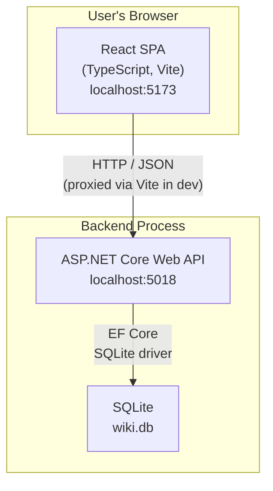
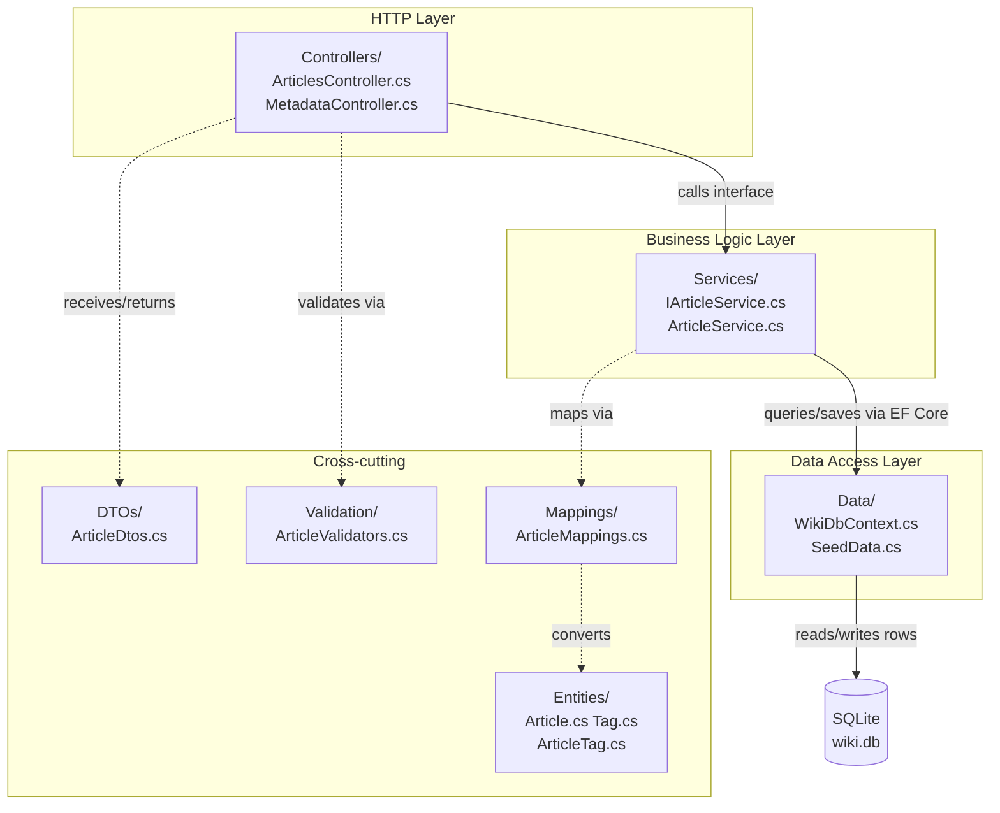
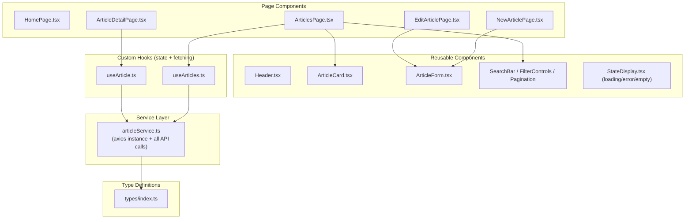
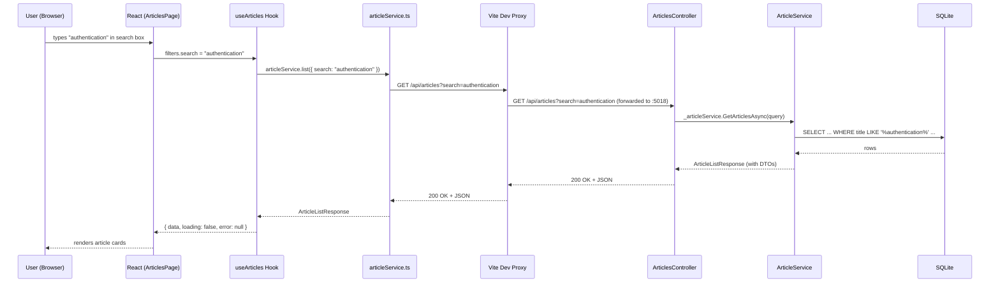

# Architecture Guide — WikiProject

> **Audience:** A newer developer who is comfortable with code but may be new to
> full-stack .NET / React projects.  
> **Goal:** Not just "here is the map" — but *why* the map looks the way it does,
> what alternatives exist, and what you should study next.
>
> **Related future docs (written by other agents in parallel):**
> - `02_BACKEND_DEEP_DIVE.md` — detailed tour of every backend file
> - `03_FRONTEND_DEEP_DIVE.md` — detailed tour of every frontend file
> - `04_DATA_MODEL.md` — full database schema reference
> - `05_API_REFERENCE.md` — every endpoint documented with examples

---

## Table of Contents

1. [What Is This System?](#1-what-is-this-system)
2. [30-Second Mental Model](#2-30-second-mental-model)
3. [Overall Architectural Style](#3-overall-architectural-style)
4. [The Frontend / Backend Split](#4-the-frontend--backend-split)
5. [Inside the Backend — Layered Architecture](#5-inside-the-backend--layered-architecture)
6. [The Role of Each Piece](#6-the-role-of-each-piece)
   - [Entities](#61-entities)
   - [DTOs (Data Transfer Objects)](#62-dtos-data-transfer-objects)
   - [Services](#63-services)
   - [Controllers](#64-controllers)
   - [Persistence (DbContext)](#65-persistence-dbcontext)
   - [Mappings](#66-mappings)
   - [Validation](#67-validation)
7. [Inside the Frontend — Component & Service Architecture](#7-inside-the-frontend--component--service-architecture)
8. [Client / Server Responsibility Split](#8-client--server-responsibility-split)
9. [Request Flow End-to-End](#9-request-flow-end-to-end)
10. [Why This Architecture Fits an MVP Internal Wiki](#10-why-this-architecture-fits-an-mvp-internal-wiki)
11. [How This Architecture Helps You Learn](#11-how-this-architecture-helps-you-learn)
12. [Comparison with Alternative Approaches](#12-comparison-with-alternative-approaches)
13. [Where This Architecture May Become Insufficient](#13-where-this-architecture-may-become-insufficient)
14. [How to Mentally Picture This System](#14-how-to-mentally-picture-this-system)

---

## 1. What Is This System?

WikiProject is a small **internal knowledge-base / wiki application**.  Think of it as a
private Wikipedia for a team: team members can write articles, tag them, categorise them,
search them, and manage their lifecycle (Draft → Published → Archived).

The system has two independent runnable programs that talk to each other over HTTP:

| Program | Technology | What it does |
|---------|-----------|--------------|
| **Backend API** | ASP.NET Core (.NET 10) | Stores data, enforces rules, exposes a REST API |
| **Frontend SPA** | React 19 + TypeScript + Vite | Renders the UI in the browser, calls the API |

There is also a **SQLite database file** (`wiki.db`) that the backend owns and writes to.
The frontend never touches the database directly.

---

## 2. 30-Second Mental Model

Before diving into details, here is the complete system on a single diagram.



**Key facts to hold in your head:**

1. The browser downloads the React app **once** (as static HTML + JS), then it runs
   entirely client-side.
2. Every time the app needs data (articles, categories, tags), it makes an **HTTP request
   to the backend API**.
3. The backend handles **all persistence** — it is the single source of truth.
4. In production these two programs would typically be deployed as separate processes
   (or containers), possibly behind a reverse proxy.

---

## 3. Overall Architectural Style

The system follows two well-known styles that are almost universal in modern web
development:

### 3.1 REST API + SPA (Separated Frontend/Backend)

The backend exposes a **REST API** (Representational State Transfer).  
That means:
- Resources (articles, tags, categories) are identified by URLs.
- HTTP verbs express intent: `GET` = read, `POST` = create, `PUT` = update,
  `DELETE` = remove.
- Responses are **JSON** — a format both JavaScript and .NET understand easily.
- The server is **stateless**: each request carries everything the server needs
  (no sessions stored on the server between requests).

The frontend is a **Single-Page Application (SPA)**.  
That means:
- The browser loads one `index.html` and one JavaScript bundle.
- Navigation happens client-side (React Router changes what is rendered without
  a full page reload).
- When data is needed, JavaScript makes background HTTP calls and updates the
  rendered output.

### 3.2 N-Tier Layered Architecture (Backend)

Inside the backend, code is organised into **horizontal layers** where each layer
has a single responsibility and only talks to the layer below it:

```
Controller → Service → DbContext → Database
```

This is sometimes called *N-Tier* or *Layered Architecture*. You will see this pattern
in most enterprise .NET code.

---

## 4. The Frontend / Backend Split

### Why split them at all?

**The problem with mixing UI and data-access code together** is that everything
becomes coupled.  If you want to change how articles are stored, you have to edit
the same file that renders the list.  If you want to add a mobile app later, you
have to duplicate all the data-access logic.

**Splitting creates a contract (the API).**  
The frontend only knows about the JSON shapes the API returns.  
The backend only knows about HTTP requests and responses.  
Either side can change its internals without breaking the other, as long as the
API contract stays stable.

### How they communicate in development

During local development there is a small trick worth understanding:

```
Browser (port 5173)
    │
    │  GET /api/articles          ← Vite dev server intercepts this
    ▼
Vite Dev Server (port 5173)
    │
    │  forwards to http://localhost:5018/api/articles
    ▼
Backend API (port 5018)
    │
    │  responds with JSON
    ▼
Vite Dev Server
    │
    │  forwards response back to browser
    ▼
Browser ← receives JSON as if it came from port 5173
```

This **proxy** is configured in `frontend/vite.config.ts`:

```typescript
server: {
  proxy: {
    '/api': {
      target: 'http://localhost:5018',
      changeOrigin: true,
    },
  },
},
```

Without this proxy, the browser would see requests going to `localhost:5018` from a
page loaded from `localhost:5173`.  Browsers block this as a **Cross-Origin Resource
Sharing (CORS)** violation by default.

The Vite proxy makes both sides appear to be on the same origin to the browser.
On the backend, CORS is still explicitly configured (in `Program.cs`) to allow
`http://localhost:5173` — this handles direct requests and any production scenario
where the proxy is absent.

### Common beginner confusion

> *"The frontend runs in the browser.  Why does it have a server?"*

Vite is a **build-time and development tool**, not a runtime server.  In production
you would run `npm run build` to produce static files (HTML, JS, CSS) and serve
those from any static file host (Nginx, S3, Azure Static Web Apps, etc.).  The Vite
"server" only exists during local development to give you fast hot-reload.

---

## 5. Inside the Backend — Layered Architecture

Here is how the backend is layered, with the corresponding directories:



### Why layering matters

Imagine you decide to switch from SQLite to PostgreSQL.  
With this layered design, you only touch `WikiDbContext.cs` (swap the provider) and
possibly the connection string.  The controllers and services don't care — they never
mention SQLite.

Or imagine you want to replace the REST API with a GraphQL API.  
You would add a new GraphQL endpoint layer; the `Services/` code is untouched because
it has no HTTP knowledge.

---

## 6. The Role of Each Piece

### 6.1 Entities

**What:** C# classes that represent the *shape of a database row*.  
**Where:** `src/WikiProject.Api/Entities/`  
**Example:** `Article.cs`

```csharp
public class Article
{
    public int Id { get; set; }
    public string Title { get; set; } = string.Empty;
    public string Slug { get; set; } = string.Empty;
    public string Content { get; set; } = string.Empty;
    // ... more fields
    public ICollection<ArticleTag> ArticleTags { get; set; } = new List<ArticleTag>();
}
```

Entity Framework Core (EF Core) uses these classes to generate the database schema
and to load/save rows.  An entity instance is a **direct in-memory mirror of a
database row**.

**Why you never send entities directly to the client:**  
Entities can contain database internals, circular references, or data you don't want
to expose.  Instead, you convert them to DTOs (see below) before sending them over
the wire.

**Key relationship:** `Article` → `ArticleTag` ← `Tag` forms a many-to-many.  
One article can have many tags; one tag can belong to many articles.  
`ArticleTag` is the **join table** (a row that holds `ArticleId + TagId`).

### 6.2 DTOs (Data Transfer Objects)

**What:** Simple, immutable C# records that define exactly what JSON the API sends
or receives.  
**Where:** `src/WikiProject.Api/DTOs/ArticleDtos.cs`

```csharp
public record ArticleDto(
    int Id,
    string Title,
    string Slug,
    string Summary,
    string Content,
    string Category,
    IReadOnlyList<string> Tags,   // flat list, not raw ArticleTag objects
    string Status,
    DateTime CreatedAt,
    DateTime UpdatedAt
);
```

Notice that `Tags` is a plain `IReadOnlyList<string>` here.  
In the entity it is `ICollection<ArticleTag>` (a list of join-table objects with
navigation properties).  The DTO hides the join-table complexity from the client.

**Why C# `record` instead of `class`?**  
Records are value-based (equality by content, not reference), immutable by default
with positional parameters, and require less boilerplate.  They are ideal for
request/response models that are never modified after creation.

**Two shapes of article DTO:**
- `ArticleDto` — full article including `Content` (for detail pages).
- `ArticleSummaryDto` — everything except `Content` (for list pages, saves bandwidth).

**Request models:**
- `CreateArticleRequest` — what the client POSTs when creating.
- `UpdateArticleRequest` — what the client PUTs when editing.

**Common beginner confusion:**

> *"Why do we have an entity AND a DTO that look almost the same?  Seems like
> duplication."*

They serve different concerns:
- The entity is owned by EF Core and the database schema.
- The DTO is owned by the API contract and the client.
- When the database schema evolves (e.g., adding an internal audit column), the DTO
  stays stable if you don't want to expose that column.
- When the API contract needs to change (e.g., flattening a nested structure for the
  client), you change the DTO without touching the database schema.

### 6.3 Services

**What:** The home of **business logic** — rules, calculations, and data access that
are not the HTTP layer's concern.  
**Where:** `src/WikiProject.Api/Services/`  
**Interface:** `IArticleService.cs`  
**Implementation:** `ArticleService.cs`

The service is where "thinking" happens:

```csharp
// Slug generation — a business rule
private static string GenerateSlug(string title)
{
    var slug = title.ToLower().Trim();
    slug = Regex.Replace(slug, @"[^a-z0-9\s-]", "");  // remove special chars
    slug = Regex.Replace(slug, @"\s+", "-");            // spaces → hyphens
    return slug.Length > 100 ? slug[..100] : slug;      // cap at 100 chars
}

// Uniqueness enforcement — a business rule
private async Task<string> EnsureUniqueSlugAsync(string baseSlug, int? excludeId = null)
{
    var slug = baseSlug;
    var counter = 1;
    while (await _db.Articles.Where(a => a.Slug == slug).AnyAsync())
        slug = $"{baseSlug}-{counter++}";
    return slug;
}

// Tag resolution — find existing or create new
private async Task<List<Tag>> ResolveTagsAsync(IReadOnlyList<string>? tagNames) { ... }
```

None of this belongs in a controller (which should only handle HTTP plumbing) or in the
database layer (which should only store/retrieve data).

**Why an interface (`IArticleService`)?**  
The controller declares that it needs *something* that implements `IArticleService`.
It doesn't care which concrete class that is.  This is called **dependency inversion**
— a core principle of clean architecture.  Benefits:

- **Testability**: In tests you can substitute a fake (`MockArticleService`) without
  hitting the database.
- **Replaceability**: You could swap `ArticleService` for `CachedArticleService` in
  `Program.cs` without changing the controller.

### 6.4 Controllers

**What:** Thin HTTP handlers.  They receive an HTTP request, validate it, call a
service, and return an HTTP response.  
**Where:** `src/WikiProject.Api/Controllers/`

```csharp
[HttpGet]
public async Task<ActionResult<ArticleListResponse>> GetArticles(
    [FromQuery] string? search,
    [FromQuery] string? category,
    [FromQuery] ArticleStatus? status,
    [FromQuery] int page = 1,
    [FromQuery] int pageSize = 20)
{
    var query = new ArticleQueryParams(search, category, null, status, page, pageSize);
    var result = await _articleService.GetArticlesAsync(query);
    return Ok(result);   // HTTP 200 + JSON body
}
```

Observe how short this is.  There is no SQL, no slug logic, no tag resolution.
The controller's job is:

1. Parse the HTTP request into C# objects (`[FromQuery]`, `[FromBody]`).
2. Run validation (delegates to FluentValidation).
3. Call the service.
4. Return the appropriate HTTP status code + body.

**Controller attributes:**

```csharp
[ApiController]           // Enables automatic model-binding, validation errors as 400
[Route("api/articles")]   // Base URL for all actions
[Produces("application/json")]
```

`[ApiController]` is important: it automatically returns `400 Bad Request` with a
problem-details body if model binding fails, without you writing any extra code.

### 6.5 Persistence (DbContext)

**What:** The gateway to the database, provided by Entity Framework Core.  
**Where:** `src/WikiProject.Api/Data/WikiDbContext.cs`

EF Core's `DbContext` is two things at once:
- A **unit of work**: it tracks changes you make to entities in memory, then
  writes them all in one `SaveChangesAsync()` call (a single database transaction).
- A **repository factory**: `_db.Articles`, `_db.Tags`, `_db.ArticleTags` are
  `DbSet<T>` objects that let you write LINQ queries that EF Core translates to SQL.

**Example from `ArticleService.cs`:**

```csharp
var q = _db.Articles
    .Include(a => a.ArticleTags)     // JOIN to ArticleTag
        .ThenInclude(at => at.Tag)   // JOIN to Tag
    .AsNoTracking()                  // read-only, slightly faster
    .Where(a => a.Title.ToLower().Contains(search));

var totalCount = await q.CountAsync();   // SELECT COUNT(*)
var items = await q
    .OrderByDescending(a => a.UpdatedAt)
    .Skip((page - 1) * pageSize)
    .Take(pageSize)
    .ToListAsync();                      // SELECT ... LIMIT ... OFFSET ...
```

EF Core translates this LINQ chain to SQL at runtime.  You write C# and get SQL for
free (mostly).

**`.AsNoTracking()` note:** When you only need to read data and won't modify it,
`.AsNoTracking()` tells EF Core not to keep a snapshot of each object to detect
changes later.  This is faster and uses less memory.  For writes (create/update/delete),
you use regular tracked queries.

**Migrations:** Every change to the schema (adding a table, adding a column) is
captured in a *migration* file.  On startup, `db.Database.Migrate()` in `Program.cs`
applies any pending migrations automatically.  This means you never need to manually
run SQL scripts to keep the schema in sync.

### 6.6 Mappings

**What:** Extension methods that convert entities to DTOs.  
**Where:** `src/WikiProject.Api/Mappings/ArticleMappings.cs`

```csharp
public static ArticleDto ToDto(this Article article) =>
    new ArticleDto(
        article.Id,
        article.Title,
        article.Slug,
        article.Summary,
        article.Content,
        article.Category,
        article.ArticleTags.Select(at => at.Tag.Name).OrderBy(n => n).ToList(),
        article.Status.ToString(),
        article.CreatedAt,
        article.UpdatedAt
    );
```

These are C# extension methods — they look like they are methods on `Article` but
they are defined elsewhere.  Calling `article.ToDto()` is syntactic sugar for
`ArticleMappings.ToDto(article)`.

**Why not use AutoMapper (or similar)?**  
AutoMapper is a popular library that auto-maps properties by name.  For a small project
like this, explicit mapping code is clearer — you can see exactly what is being
converted, and the compiler catches mistakes.  AutoMapper adds value in very large
projects where you have dozens of entity/DTO pairs, but it also adds indirection that
makes debugging harder.

### 6.7 Validation

**What:** Rules that check whether incoming data is acceptable before it is processed.  
**Where:** `src/WikiProject.Api/Validation/ArticleValidators.cs`  
**Library:** [FluentValidation](https://docs.fluentvalidation.net/)

```csharp
public class CreateArticleRequestValidator : AbstractValidator<CreateArticleRequest>
{
    public CreateArticleRequestValidator()
    {
        RuleFor(r => r.Title).NotEmpty().MaximumLength(200);
        RuleFor(r => r.Summary).NotEmpty().MaximumLength(500);
        RuleFor(r => r.Content).NotEmpty();
        RuleFor(r => r.Category).NotEmpty().MaximumLength(100);
        // ... more rules
    }
}
```

**Why FluentValidation instead of built-in Data Annotations?**  
Data annotations (`[Required]`, `[MaxLength(200)]`) are placed directly on the model
class — they mix concerns (the DTO carries its own validation rules).  FluentValidation
puts all rules in a separate class, allows complex multi-property rules, is fully
testable, and produces much richer error messages.

**Where validation is invoked — the controllers:**

```csharp
[HttpPost]
public async Task<ActionResult<ArticleDto>> Create(
    [FromBody] CreateArticleRequest request,
    [FromServices] IValidator<CreateArticleRequest> validator)
{
    var validation = await validator.ValidateAsync(request);
    if (!validation.IsValid)
        return ValidationProblem(new ValidationProblemDetails(
            validation.ToDictionary()));
    // ...
}
```

`ValidationProblem(...)` returns an HTTP `400 Bad Request` response with a
`application/problem+json` body — a standard format (RFC 7807) for error responses.

---

### Section 5–6 Recap

| Layer | Directory | Responsibility |
|-------|-----------|----------------|
| Controllers | `Controllers/` | HTTP parsing, validation trigger, response codes |
| Services | `Services/` | Business logic, slug generation, tag resolution |
| DbContext | `Data/` | Database access, unit of work, migrations |
| Entities | `Entities/` | Database row shape (EF Core models) |
| DTOs | `DTOs/` | API contract shape (request / response models) |
| Mappings | `Mappings/` | Entity → DTO conversion |
| Validation | `Validation/` | Input validation rules |

---

## 7. Inside the Frontend — Component & Service Architecture

The React frontend mirrors the layering idea but uses different vocabulary.



### Pages vs Components

**Pages** live in `src/pages/` and represent a full screen the user navigates to.
Each page usually:
- Reads data (via a custom hook).
- Renders a layout by composing multiple smaller components.
- Handles navigation (e.g., after creating an article, redirect to detail view).

**Components** live in `src/components/` and are reusable building blocks.  A component
should not know which page it is on — it only cares about the props it receives.

### Custom Hooks — state and fetching together

Custom hooks (files starting with `use`) bundle together the state variables and the
effects that fetch data:

```typescript
// src/hooks/useArticles.ts (simplified)
export function useArticles(filters: ArticleFilters) {
  const [data, setData] = useState<ArticleListResponse | null>(null);
  const [loading, setLoading] = useState(true);
  const [error, setError] = useState<string | null>(null);

  useEffect(() => {
    setLoading(true);
    articleService.list(filters)
      .then(setData)
      .catch(err => setError(getErrorMessage(err)))
      .finally(() => setLoading(false));
  }, [filters.search, filters.category, /* ... */]);

  return { data, loading, error };
}
```

Pages call this hook and get back `{ data, loading, error }` — they don't need to
know how the HTTP call works.  This is the same separation-of-concerns principle as
the backend's service layer.

### The Service Layer (frontend)

`src/services/articleService.ts` is a plain object containing all API call functions:

```typescript
const api = axios.create({
  baseURL: import.meta.env.VITE_API_URL ?? 'http://localhost:5018',
  headers: { 'Content-Type': 'application/json' },
});

export const articleService = {
  async list(filters) { return (await api.get('/api/articles', { params })).data; },
  async getById(id)  { return (await api.get(`/api/articles/${id}`)).data; },
  async create(req)  { return (await api.post('/api/articles', req)).data; },
  // ...
};
```

**Why not call `axios.get(...)` directly from components?**  
The same reason the backend separates controllers from services: if the API URL changes,
or if you want to add request interceptors (e.g., attach an auth token), you change it
in one place.

### TypeScript types

All shared type definitions live in `src/types/index.ts`:

```typescript
export interface Article extends ArticleSummary {
  content: string;
}

export interface ArticleListResponse {
  items: ArticleSummary[];
  totalCount: number;
  page: number;
  pageSize: number;
  totalPages: number;
}
```

These mirror the backend DTOs.  If the backend changes its response shape, you update
these types and TypeScript will immediately flag every place in the frontend that breaks
— a huge help for catching mistakes early.

---

## 8. Client / Server Responsibility Split

Understanding *who is responsible for what* prevents a common anti-pattern: duplicating
logic in two places or, worse, putting business logic in the wrong place.

| Concern | Who owns it | Why |
|---------|-------------|-----|
| Storing and retrieving articles | **Backend** | Single source of truth; consistent for all clients |
| Slug generation and uniqueness | **Backend** | Must be enforced at storage level; two clients could race otherwise |
| Tag creation and deduplication | **Backend** | Tags are shared across articles; only the backend can see all tags |
| Input validation rules | **Backend** (authoritative) + **Frontend** (UX convenience) | Backend enforces correctness; frontend gives instant feedback without a round-trip |
| Displaying articles | **Frontend** | The server doesn't know whether you have a screen, a printer, or an RSS reader |
| Client-side routing (URL changes without page reload) | **Frontend** | No server involvement; React Router manages this |
| Formatting dates and status labels | **Frontend** (`utils/format.ts`) | Display is a UI concern |
| Pagination UI | **Frontend** | Which page you are on is a display state, not data state |
| Pagination data (total count, total pages) | **Backend** | Only the database knows how many records exist |
| CORS enforcement | **Backend** | Browsers enforce CORS; the server must respond with the right headers |
| Authentication (future) | **Both** | Backend issues / validates tokens; frontend attaches tokens and redirects |

### Why this matters

A frequent mistake for beginners is putting database queries directly in controllers
("I can just write `_db.Articles.Where(...)` right here").  This works for toy projects
but quickly causes problems:

- The controller grows to hundreds of lines.
- The same query appears in multiple controllers (copy-paste duplication).
- You cannot test the query logic without also setting up HTTP request mocking.
- When you add caching or change the ORM, you have to hunt down every controller.

The layer separation in this project avoids all of these.

---

## 9. Request Flow End-to-End

Here is what happens when a user searches for articles from the browser.



**Trace of the code path:**

1. `ArticlesPage.tsx` passes filter state to `useArticles(filters)`.
2. `useArticles` calls `articleService.list(filters)`.
3. `articleService.list` calls `axios.get('/api/articles', { params })`.
4. Vite proxy forwards the request to `localhost:5018`.
5. `ArticlesController.GetArticles` receives the query params.
6. Controller calls `_articleService.GetArticlesAsync(query)`.
7. `ArticleService.GetArticlesAsync` builds a LINQ query on `_db.Articles`, applies
   `.Where(...)`, `.Skip(...)`, `.Take(...)`, and calls `ToListAsync()`.
8. EF Core translates LINQ to SQL and queries the SQLite file.
9. Results are mapped to `ArticleSummaryDto` via `article.ToSummaryDto()`.
10. Controller returns `Ok(result)` → HTTP 200 + JSON.
11. `useArticles` stores the response in React state.
12. `ArticlesPage` re-renders with article cards.

---

## 10. Why This Architecture Fits an MVP Internal Wiki

### Small and understandable

The entire backend is a single ASP.NET Core project.  The entire frontend is a single
Vite/React app.  A new developer can clone the repo, follow the README, and be running
locally in minutes.

There is no message queue, no microservice mesh, no container orchestration, no
separate auth service.  Every piece of complexity introduced has a clear justification
in the current requirements.

### Fits a single team / small company

An internal wiki does not need to handle millions of requests per second.  SQLite is
perfectly capable of handling dozens of concurrent readers and occasional writes.  The
architecture allows for a future database swap (just change the EF Core provider) if
scale ever demands it.

### Layering pays off quickly

Even at this small scale, the layers are already earning their keep:
- Adding a new search filter requires a change in `ArticleService` only — the controller
  already passes `ArticleQueryParams`, the frontend already sends query params.
- Adding a new field to an article requires: adding to the entity, generating a
  migration, adding to the DTO, updating the mapping.  Each step is mechanical and
  isolated.

### The project is structured to grow

The `Program.cs` already has commented-out hooks for authentication.  The
`ArticleStatus` enum already supports a future moderation workflow.  The seed data
includes an article describing the planned authentication approach.  This is not
accidental — the architecture anticipates common growth directions without over-building.

---

## 11. How This Architecture Helps You Learn

Working on this project gives you exposure to patterns that appear in the vast majority
of professional .NET / React codebases:

| Concept | Where you see it here | Why it matters at work |
|---------|----------------------|------------------------|
| Dependency Injection | `Program.cs` registers services; controllers receive them via constructor | Used everywhere in .NET; enables testing and modularity |
| Interface-based design | `IArticleService` | Allows mocking in tests; enables swapping implementations |
| EF Core code-first migrations | `Migrations/` directory | Standard database versioning in .NET |
| DTO / Entity separation | `DTOs/` vs `Entities/` | Prevents leaking internal data; standard in every real API |
| FluentValidation | `Validation/` | Used in most enterprise .NET projects |
| React Hooks (custom) | `hooks/` | Core React pattern since 2019 |
| Axios service layer | `services/articleService.ts` | Standard in React codebases |
| TypeScript interfaces | `types/index.ts` | Strongly-typed frontends are the industry standard |
| Vite dev proxy | `vite.config.ts` | Appears in nearly every React + separate-backend project |

**Suggested study path after reading this document:**

1. **EF Core fundamentals** — [Microsoft's EF Core docs](https://learn.microsoft.com/en-us/ef/core/)
2. **ASP.NET Core Web API** — [Official tutorial](https://learn.microsoft.com/en-us/aspnet/core/web-api/?view=aspnetcore-10.0)
3. **React Hooks in depth** — [React documentation (react.dev)](https://react.dev/reference/react)
4. **TypeScript handbook** — [typescriptlang.org/docs](https://www.typescriptlang.org/docs/)
5. **REST API design** — [REST API Design Rulebook (O'Reilly)](https://www.oreilly.com/library/view/rest-api-design/9781449317904/)
6. **Clean Architecture** — [Robert C. Martin's blog](https://blog.cleancoder.com/uncle-bob/2012/08/13/the-clean-architecture.html) (the theory behind the layering used here)

---

## 12. Comparison with Alternative Approaches

### 12.1 Monolith vs Microservices

| | Monolith (this project) | Microservices |
|-|------------------------|---------------|
| **What it is** | All backend code in one deployable unit | Multiple small, independent services communicating over HTTP/messaging |
| **Complexity** | Low — one process, one database | High — service discovery, distributed tracing, eventual consistency |
| **Good for** | MVPs, internal tools, small teams | Large teams with multiple independent domains |
| **This project** | ✅ Correct choice | ❌ Massive over-engineering for a wiki |

**When to consider microservices:** When different parts of the system need to be
deployed, scaled, or developed at different velocities by different teams.  For an
internal wiki with one backend service, microservices would triple the complexity
with no benefit.

### 12.2 Controller-based API vs Minimal APIs

ASP.NET Core 6+ introduced **Minimal APIs** — defining endpoints as lambda functions
in `Program.cs` without controller classes:

```csharp
// Minimal API style
app.MapGet("/api/articles", async (IArticleService svc, [FromQuery] string? search) =>
    Results.Ok(await svc.GetArticlesAsync(new ArticleQueryParams(search, ...))));
```

| | Controller-based (this project) | Minimal APIs |
|-|--------------------------------|--------------|
| **Boilerplate** | More (class, attributes, constructor) | Less |
| **Discoverability** | Good (grouped by controller) | Can get scattered in large apps |
| **Testing** | Well-established patterns | Newer patterns, improving rapidly |
| **Good for** | Large surface areas, teams familiar with MVC | Small services, quick prototypes |

**This project uses controllers** — the more familiar and widely documented pattern.
For a 10-endpoint API with 2 controllers, either would work; controllers win on
familiarity.

### 12.3 Layered Architecture vs Feature-based Architecture

**Feature-based (vertical slices)** organises code by feature, not by technical role:

```
articles/
  ArticleController.cs
  ArticleService.cs
  ArticleDto.cs
  Article.cs         (entity)
  ArticleValidator.cs
```

vs this project's horizontal layering:

```
Controllers/   Services/   DTOs/   Entities/   Validation/
```

| | Horizontal layers (this project) | Vertical / feature slices |
|-|----------------------------------|--------------------------|
| **Navigation** | Know the role → find the folder | Know the feature → find the folder |
| **Coupling** | Clear layer boundaries | Can lead to loose layer discipline |
| **Good for** | Smaller apps, clear role separation | Larger apps where features are independently shippable |

For a two-controller app with closely related features, the horizontal approach is
simpler.  If WikiProject grew to 10 distinct domains (articles, users, permissions,
notifications, etc.), a feature-based structure would scale better.

### 12.4 Service Layer vs Direct Data Access in Controllers

**Without a service layer:**

```csharp
// Anti-pattern: DbContext used directly in controller
[HttpPost]
public async Task<IActionResult> Create([FromBody] CreateArticleRequest req)
{
    var slug = GenerateSlug(req.Title);  // business logic in controller
    var article = new Article { /* ... */ };
    _db.Articles.Add(article);
    await _db.SaveChangesAsync();
    return CreatedAtAction(...);
}
```

The problems:
- The controller now knows about slug generation (a business rule, not HTTP plumbing).
- The controller now needs the `DbContext` directly — harder to test.
- If two controllers need slug generation, you copy the code.

**With a service layer (this project):** Controllers stay thin; business rules stay in
`ArticleService`; testing is straightforward because you can mock `IArticleService`.

### 12.5 SPA Frontend vs Server-rendered Frontend

| | SPA (this project — React) | Server-rendered (Razor Pages, Blazor SSR) |
|-|---------------------------|------------------------------------------|
| **First load** | Downloads JS bundle, then renders | Server sends ready HTML |
| **Subsequent navigation** | Instant (client-side routing) | Full page reload (or partial with htmx) |
| **SEO** | Needs extra work (SSR or pre-rendering) | Good out of the box |
| **Interactivity** | Rich, app-like | Can be rich with JavaScript, but more effort |
| **Good for** | App-like tools used by logged-in users | Public marketing sites, content sites |

An internal wiki used by logged-in employees doesn't need great SEO, and benefits
from rich client-side interactivity.  A React SPA is a natural fit.

If the wiki ever needs to be public-facing or crawlable by search engines, you'd add
**server-side rendering (SSR)** (e.g., using Next.js) or switch to a server-rendered
approach.

### 12.6 Split Frontend/Backend Repo vs Combined Web App (BFF)

This project uses a **split deployment model**: the frontend and backend are in the
same repository but are separate processes.

An alternative is a **Backend for Frontend (BFF)** or a combined app where the .NET
backend also serves the React build output:

```csharp
// In Program.cs — serve the React build output from ASP.NET Core
app.UseStaticFiles();
app.MapFallbackToFile("index.html");  // For client-side routing
```

| | Split processes (this project) | Combined single app |
|-|-------------------------------|---------------------|
| **Complexity** | Two processes, proxy needed in dev | One process, simpler deployment |
| **Flexibility** | Frontend can be on a CDN, backend on a server | Both must scale together |
| **Dev experience** | Two terminals to start | One `dotnet run` starts everything |
| **Production** | More deployment options | Simpler for a single-server deployment |

For a small internal tool that won't need a CDN, combining them into one ASP.NET Core
app that serves the React build output is a viable simplification.  The current split
is pedagogically cleaner and prepares the codebase for independent scaling.

---

## 13. Where This Architecture May Become Insufficient

This section is not a criticism — it is honest about the trade-offs of choosing
simplicity now.

### 13.1 Authentication and Multi-user Ownership

The system currently has no authentication.  All articles are visible and editable by
anyone who can reach the URL.  Once authentication is added, the service layer will
need to enforce ownership rules:

```csharp
// Future: service must check that the logged-in user owns the article
if (article.AuthorId != currentUser.Id && !currentUser.IsAdmin)
    throw new ForbiddenException();
```

The architecture handles this cleanly — you add the check to `ArticleService`, and the
controller gets the current user from the HTTP context via a claim.

### 13.2 Full-text Search

The current search is a LINQ `.Contains()` query which translates to SQL `LIKE
'%term%'`.  This is case-insensitive and works for small datasets, but it:
- Cannot rank results by relevance.
- Cannot handle typos (fuzzy matching).
- Will become slow on large datasets without a full-text search index.

For a larger wiki, you would integrate **SQLite FTS5** (SQLite's built-in full-text
search extension), **Elasticsearch**, or **Azure Cognitive Search**.

### 13.3 Rich Content

Articles currently store markdown as plain text.  The frontend renders it as text.
As the wiki grows, editors will want:
- A rich WYSIWYG editor (ProseMirror, TipTap).
- Rendered markdown (marked.js, react-markdown).
- Image uploads (requires a storage service — S3, Azure Blob Storage).

None of these require architectural changes; they are additions to the existing
`ArticleForm.tsx` and `ArticleDetailPage.tsx`.

### 13.4 Concurrency and Conflicts

EF Core's `SaveChangesAsync` performs a last-write-wins update.  If two users edit the
same article simultaneously, the second save silently overwrites the first.  

For a busy team wiki, you would add **optimistic concurrency** using EF Core's
`[Timestamp]` / `rowversion` feature, which causes EF Core to throw a
`DbUpdateConcurrencyException` if the row was modified since it was last read.

### 13.5 Read Performance

SQLite is a file-based database.  It handles concurrent reads well but is not designed
for large numbers of concurrent writes or for distributed deployments (multiple backend
instances writing to the same file).  If WikiProject ever needs to run as multiple
instances behind a load balancer, you would need to migrate to **PostgreSQL** or
**SQL Server** — which EF Core supports with a one-line change in `Program.cs`.

---

## 14. How to Mentally Picture This System

If you are ever confused about where something belongs, use these mental models:

### The "Department Store" metaphor

Think of the backend as a department store.

- **Controllers** are the **reception desk** — they greet visitors (HTTP requests),
  check their paperwork (validation), and direct them to the right department.
- **Services** are the **departments** — they do the actual work: finding articles,
  creating tags, enforcing business rules.
- **DbContext** is the **warehouse** — it stores everything and knows how to find it
  quickly, but it has no opinions about business rules.
- **Entities** are the **inventory items** — raw goods with a specific shape defined
  by the warehouse.
- **DTOs** are the **product listings on the website** — a curated, customer-friendly
  view of the inventory, not necessarily showing every internal detail.
- **Validators** are the **quality control team** — they check that incoming requests
  meet the required standard before any work is done.

### The "Request Journey" mental model

Imagine a request as a traveller passing through checkpoints:

```
Internet → [CORS check] → [Controller] → [Validation] → [Service] → [Database]
                                                              │
                                          Response ← [Mapping] ← [Entities]
```

Every outbound response travels the reverse path: entities are mapped to DTOs,
DTOs are serialised to JSON, JSON travels across the network.

### The "Two worlds" metaphor for the frontend/backend split

Think of the frontend and backend as two separate countries that can only communicate
by sending letters (HTTP requests) in a standard language (JSON).

- The frontend country speaks TypeScript and renders UI.
- The backend country speaks C# and owns data.
- Neither can read the other's internal variables.
- They have agreed on a treaty (the API contract) that defines what messages look like.

When you are debugging, the first question to ask is: *"Is this a frontend problem or
a backend problem?"*  

- If the data is wrong in the database → backend problem.
- If the data looks right in the network response but wrong on screen → frontend problem.
- If the network response is wrong → backend problem.

Use your browser's **DevTools → Network tab** as the border crossing: everything on
the left side is frontend, everything on the right side is backend.

---

### Final Recap

| Question | Answer |
|----------|--------|
| What style is this? | REST API + SPA; layered (N-Tier) backend |
| What is the frontend? | React 19 + TypeScript, built with Vite |
| What is the backend? | ASP.NET Core (.NET 10) Web API |
| What is the database? | SQLite, accessed via EF Core |
| How do they talk? | HTTP + JSON; Vite proxy in dev, CORS in production |
| Why is it split? | Separation of concerns; each side can evolve independently |
| Where does business logic live? | In `Services/` — never in controllers or DbContext |
| Where does HTTP parsing live? | In `Controllers/` — never in services |
| Where does the schema live? | In `Entities/` + `Migrations/` |
| What does the client receive? | DTOs — never raw entity objects |
| Is this architecture final? | No — authentication, full-text search, and richer content are natural next steps |

> 📖 **Related docs (to be written by other agents):**  
> - `02_BACKEND_DEEP_DIVE.md` — Detailed walkthrough of every backend file  
> - `03_FRONTEND_DEEP_DIVE.md` — Detailed walkthrough of every frontend file  
> - `04_DATA_MODEL.md` — Full entity relationship diagram and field-level documentation  
> - `05_API_REFERENCE.md` — Every endpoint with request/response examples
